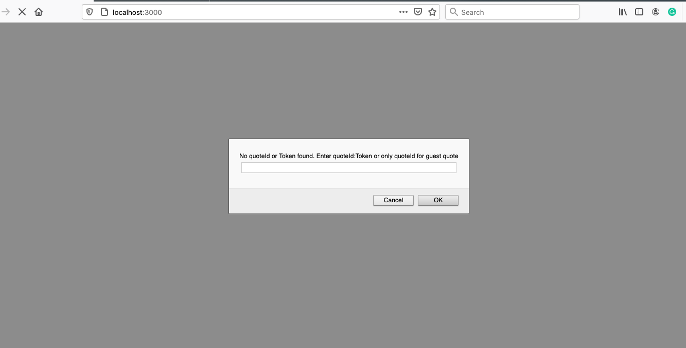

# How To Customize Hyva Checkout
Hyva checkout is a Magento 2 module which holds a react app inside it. So when you want to customize the checkout, you need to work with the react app embedded inside the module.

Also, when it comes to customization, the installation approach you have taken into account becomes important. Checkout the [**installation instructions**](/installation/) for further details.

## Development Mode
The ReactApp embedded inside Hyvä Checkout allow us to launch it as a stand alone App. This is the best way of customizing Hyvä Checkout for your site. When you launch the ReactApp, it will be served from the address `http://localhost:3000`. It will prompt you to provide a valid cartId and once you provided the cartId, you can now work with the checkout in the most efficient way as this development mode supports Hot Module Reloading (HMR).

To setting up the development environment, follow the further steps.

## Where is the react app
You can find the react app at `src/reactapp`.

## Setting up react app

1. cd into the react application

        cd src/reactapp

2. install the packages

        npm install

3. Configure your Magento 2 backend site.

    There are basically two ways you can achieve this:

    **3.a** - The cleanest approach is here. create `.env` file in `src/reactapp` directory and specify your site as shown below

        REACT_APP_BASE_URL=http://your-m2-site.com

    !!! warning "CORS complaint from the browser"
        One disadvantage you may face here is the complaint of CORS issue from browser.

    **3.b** - A hacky trick would be specify your site as your `proxy` in the `package.json`. There is
          already an entry there. Replace it with yours

        "proxy": "http://your-m2-site.com",

    Use only one option above. Don't do both.

4. There are some more configurations you can do using environment variables. You can find an example in `env.example` file. If you need any of the configurations specified there, then create `.env` file at the root path of the react app and add your custom configurations there. You can find more details of these environment variables [**here**](env_variables.md).

## Start App

In order to start the application

    npm start

The app is now available at `http://localhost:3000`

As soon as the react app kick start, it will show a prompt box to input the cart id. Well,
without the a valid cart, the checkout page is useless.

So provide a valid cart id and then you are good to go.
